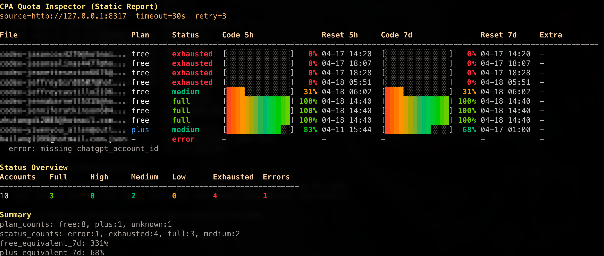

# cpausage



`cpausage` 是一个基于 CPA 管理接口的命令行配额查询工具，用来批量查看账号的 `code-5h`、`code-7d` 使用情况，并在终端里输出清晰的汇总报表。

这个项目适合已经在使用 CPA 的场景，重点是直接读取实时数据，不做离线猜测。

## 功能简介

- 读取 CPA 管理接口中的认证文件列表
- 批量查询账号真实配额窗口
- 遇到 `token_expired` 时自动关闭对应账号
- 保留并展示账号开关状态（`Switch` 为 `on/off`）
- `Code 5h` / `Code 7d` 使用固定 20 格进度条，每格 5%
- 按计划类型和剩余额度排序
- 输出彩色表格、纯文本汇总或 JSON
- 支持环境变量、命令行参数和 JSON 配置文件
- 每次推送代码到 GitHub 后自动创建一个新的 Release

## 获取方式

### 方式 1：直接下载 GitHub Release

仓库已配置自动 Release。每次代码 push 到 GitHub 后，都会自动生成一个新的 Release，并附带对应平台的独立二进制文件。

可直接选择对应平台下载：

- `cpausage_darwin_amd64`：macOS Intel
- `cpausage_darwin_arm64`：macOS Apple Silicon
- `cpausage_linux_amd64`：Linux x86_64
- `cpausage_linux_arm64`：Linux ARM64
- `cpausage_windows_amd64.exe`：Windows x86_64
- `cpausage_windows_arm64.exe`：Windows ARM64

下载后把文件改名为 `cpausage`（Windows 保留 `.exe`），再放到你的 `PATH` 中即可，例如：

```bash
chmod +x cpausage_linux_amd64
mv cpausage_linux_amd64 /usr/local/bin/cpausage
```

### 方式 2：本地构建

```bash
git clone <你的私有仓库地址>
cd <仓库目录>
go build -o dist/cpausage .
```

## 使用前准备

你至少需要这两项配置：

- `CPA_BASE_URL`：CPA 地址，例如 `http://127.0.0.1:8317`
- `CPA_MANAGEMENT_KEY`：CPA 管理密钥

推荐直接写到 shell 环境变量中，例如 `~/.zshrc`：

```bash
export CPA_BASE_URL="http://127.0.0.1:8317"
export CPA_MANAGEMENT_KEY="YOUR_MANAGEMENT_KEY"
```

然后执行：

```bash
source ~/.zshrc
```

## 最常用的用法

查看完整报表：

```bash
cpausage
```

默认美化输出使用 `--style 1`，也就是经典表格样式。

查看第二样式报表：

```bash
cpausage --style 2
```

只看汇总：

```bash
cpausage --summary-only --plain
```

输出 JSON：

```bash
cpausage --json
```

筛选低额度账号：

```bash
cpausage --filter-status low
```

筛选某种计划：

```bash
cpausage --filter-plan free
```

如果你不想使用环境变量，也可以直接传参数：

```bash
cpausage \
  --cpa-base-url http://127.0.0.1:8317 \
  --management-key YOUR_MANAGEMENT_KEY
```

也支持直接传管理页面地址：

```bash
cpausage \
  --url http://127.0.0.1:8317/management.html#/login \
  --management-password YOUR_MANAGEMENT_KEY
```

## 配置方式

支持 4 种配置来源，优先级如下：

1. 命令行参数
2. 环境变量
3. JSON 配置文件
4. 默认值

### 环境变量

- `CPA_BASE_URL`
- `CPA_URL`
- `CPA_MANAGEMENT_KEY`
- `CPA_MANAGEMENT_PASSWORD`
- `MANAGEMENT_PASSWORD`

### JSON 配置文件

可以在以下任一位置放置 JSON 配置文件：

- 可执行文件同目录下的 `cpausage.json`
- 可执行文件同目录下的 `cpa-quota-inspector.json`
- `~/.config/cpa-usage/config.json`

示例：

```json
{
  "login_url": "http://127.0.0.1:8317/management.html#/login",
  "management_password": "YOUR_MANAGEMENT_KEY"
}
```

## 主要参数

- `--cpa-base-url`：CPA 地址
- `--cpa-url`、`--url`：`--cpa-base-url` 别名
- `--management-key`、`-k`：管理密钥
- `--management-password`、`-p`：管理密钥别名
- `--config`：指定 JSON 配置文件
- `--json`：输出 JSON
- `--plain`：输出纯文本
- `--summary-only`：仅输出汇总
- `--style`：美化输出样式，`1` 为经典表格，`2` 为卡片摘要样式
- `--filter-plan`：按计划类型过滤
- `--filter-status`：按状态过滤
- `--concurrency`：并发查询数
- `--timeout`：超时秒数
- `--retry-attempts`：失败重试次数
- `--ascii-bars`：使用 ASCII 进度条
- `--no-progress`：关闭查询进度
- `--version`：输出版本信息

## 输出说明

状态按 `code-7d` 剩余额度划分：

- `full`
- `high`
- `medium`
- `low`
- `exhausted`
- `disabled`
- `error`
- `missing`

其中：

- `disabled` 表示账号在 CPA 中已关闭。手动关闭的账号不会继续发起 quota 查询；被工具因 `token_expired` 自动关闭的账号，会在每天首次运行时自动复查一次
- 当上游返回 `401` 且错误码为 `token_expired` 时，工具会先调用 CPA 管理接口关闭该账号，再把它显示为 `disabled`
- 自动关闭的账号如果在每日复查时恢复正常，工具会自动重新启用该账号
- `Switch` 列显示账号当前开关状态，`on` 为启用，`off` 为关闭
- `Code 5h` / `Code 7d` 进度条固定为 20 格，每格代表 5%

`status_counts` 的固定顺序如下：

```text
full -> high -> medium -> low -> exhausted -> disabled -> error -> missing
```

美化输出支持两种样式：

- `--style 1`：经典表格，列顺序为 `File / Code 5h / Reset 5h / Code 7d / Reset 7d / Status / Switch`
- `--style 2`：卡片摘要样式，顶部显示连接信息，中间显示同样的账号表格，底部显示 `Total / Free` 和 token usage 卡片

推荐用法：

```bash
# 经典样式
cpausage --style 1

# 第二样式（卡片摘要）
cpausage --style 2
```

## 数据来源

工具复用了 CPA 管理接口的链路：

1. `GET /v0/management/auth-files`
2. `POST /v0/management/api-call`
3. CPA 再向上游请求配额接口

## 自动 Release

仓库内置 GitHub Actions 工作流：

- 工作流文件：`.github/workflows/auto-release.yml`
- 触发方式：每次 push 到 GitHub
- 自动行为：
  - 运行 `go test ./...`
  - 自动生成一个新的 tag
  - 交叉编译多平台二进制文件
  - 自动创建 GitHub Release
  - 上传各平台二进制文件到 Release

如果你把项目推到新的私有仓库，记得在 GitHub 仓库设置里启用 Actions，并允许 `GITHUB_TOKEN` 具备 `contents: write` 权限。

## 开发

格式化并测试：

```bash
gofmt -w *.go
go test ./...
```

本地构建：

```bash
mkdir -p dist
go build -o dist/cpausage .
```

## 项目结构

- `main.go`：命令入口与参数解析
- `config.go`：配置文件加载与路径解析
- `fetch.go`：请求、解析、状态计算
- `render.go`：终端报表输出
- `helpers.go`：通用辅助函数
- `.github/workflows/auto-release.yml`：自动构建和发布多平台二进制

## 说明

- 当前不展示 code review 配额。
- 这是一个命令行工具，不依赖 Web 页面。
